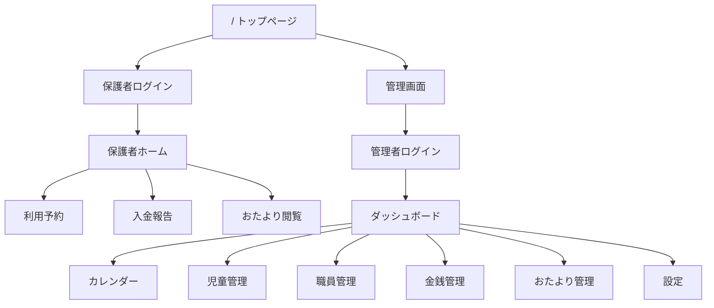

# きらきら学童クラブ 連絡帳アプリ 要件定義・仕様書

**バージョン:** 7.3  
**作成日:** 2026-02-18  
**対象:** 外部開発業者向け

---

## 1. 概要

### 1.1 プロダクト名
**きらきら学童クラブ** — 保護者とスタッフをつなぐ連絡帳Webアプリケーション

### 1.2 目的
放課後児童クラブ（学童保育）の運営を支援するWebアプリケーション。児童の入退室管理、保護者からの欠席・帰宅方法変更連絡、利用予約、入金管理、文書配信、職員勤怠管理などの機能を一元的に提供する。

### 1.3 対象ユーザー
| ロール | 説明 |
|--------|------|
| **管理者 (admin)** | 施設長・統括管理者。全権限を保有 |
| **職員 (staff)** | 現場スタッフ。入退室操作と児童管理のみ |
| **保護者 (parent)** | 登録された児童の保護者。自分の子どもに関する操作のみ |
| **ゲスト (guest)** | ログイン済みだが未登録のユーザー。アクセス不可 |

### 1.4 運用環境
- **対象デバイス:** スマートフォン（主）、タブレット、PC
- **対象ブラウザ:** Chrome、Safari（最新版）
- **ネットワーク:** Wi-Fi/4G環境

---

## 2. 技術スタック

| 項目 | 技術 |
|------|------|
| **フロントエンド** | Next.js 16 (App Router, Static Export) + React 19 |
| **言語** | TypeScript 5 |
| **CSS** | Tailwind CSS 4 |
| **UIライブラリ** | Radix UI (shadcn/ui) |
| **アイコン** | Lucide React |
| **日付処理** | date-fns |
| **認証** | Firebase Authentication (Google OAuth) |
| **データベース** | Cloud Firestore |
| **ホスティング** | Firebase Hosting (静的サイト) |
| **外部連携** | Google Apps Script (Spreadsheet ↔ Firestore の双方向同期) |
| **テスト** | Vitest + Testing Library |

### 2.1 アーキテクチャ
```
ブラウザ (SPA)
  ↓ Firebase SDK (クライアント直接通信)
Cloud Firestore (データベース)
  ↑
Google Apps Script (Spreadsheet同期用)
  ↓
Google Spreadsheet (マスターデータ管理)
```

> **重要:** サーバーサイドAPIは存在しない。フロントエンドがFirebase SDKを通じて直接Firestoreと通信する。  
> セキュリティはFirestore Security Rulesで制御する。

---

## 3. 認証・認可

### 3.1 認証方式
- **Google OAuth** (signInWithPopup) による認証
- Firebase Authenticationが発行するトークンをベースにした認証

### 3.2 ロール判定ロジック
```
1. Firebase Auth でログイン（Googleアカウント）
2. ユーザーのメールアドレスを取得
3. staff_users コレクションを検索（メールをサニタイズしたDocumentID）
   → ヒット＆isActive=true → role = staffData.role ("admin" or "staff")
4. parents コレクションを検索（email == ユーザーのメール）
   → ヒット → role = "parent"
5. どちらにも該当しない → role = "guest"（アクセス権なし）
```

### 3.3 メールサニタイズルール
メールアドレスをFirestoreのドキュメントIDとして使用する際、以下の文字を `_` に置換する：
- `.` (ピリオド)
- `#` (ハッシュ)
- `$` (ドル)
- `[` (左角括弧)
- `]` (右角括弧)

### 3.4 アクセス制御（RBAC）

| リソース | admin | staff | parent | 備考 |
|----------|-------|-------|--------|------|
| 管理画面 | ✅ 全操作 | ✅ 入退室のみ | ❌ | staff はモード切替不可 |
| 児童マスター | 読み書き | 読み書き | 自分の子のみ読取 | |
| 出席データ | 読み書き | 読み書き | 自分の子のみ読取+一部更新 | message, returnMethod等 |
| 予約 | 読み書き | 読み書き | 自分の子のみ作成/管理 | |
| 入金 | 読み書き | 読み書き | 自分の子のみ作成/読取 | |
| 文書 | 読み書き | 読み書き | 読取のみ | |
| 職員勤怠 | 読み書き | 読み書き | ❌ | |
| システム設定 | 読み書き | 読み取り | 読み取り | |
| 職員マスター | 読み書き | 読み書き | ❌ | |

### 3.5 管理者/職員モード切替
管理画面には **「Admin / Staff」モード切替トグル** がある。
- **Admin モード:** 全メニュー表示（ダッシュボード、カレンダー、児童管理、職員管理、金銭管理、おたより管理、設定）
- **Staff モード:** ダッシュボード（今日の出席のみ）に限定。日付選択不可（常に当日）
- モード切替には管理者権限が必要（PINロック機構: 4桁固定PIN `2580`）

---

## 4. 画面一覧・機能仕様

### 4.1 トップページ (`/`)
| 項目 | 内容 |
|------|------|
| 概要 | ロール選択画面。「保護者の方」と「スタッフ・管理者」の2カード |
| 遷移先 | 保護者 → `/parent/login`、管理者 → `/admin/dashboard` |
| バージョン表示 | フッターに `Ver 7.3` 表示 |

---

### 4.2 管理者ログインページ (`/login`)
| 項目 | 内容 |
|------|------|
| 概要 | Googleアカウントでログイン |
| 認証方式 | Firebase Auth (Google OAuth Popup) |
| 成功時遷移 | admin/staff → `/admin/dashboard`、parent → `/parent/home` |
| エラー表示 | 「ログインに失敗しました。」 |

---

### 4.3 管理画面共通レイアウト (`/admin/*`)

#### ナビゲーション（サイドバー）
| メニュー名 | パス | アイコン | Admin | Staff |
|-----------|------|---------|-------|-------|
| ダッシュボード | `/admin/dashboard` | LayoutDashboard | ✅ | ✅ |
| カレンダー | `/admin/calendar` | Calendar | ✅ | ❌ |
| 児童管理 | `/admin/users` | Users | ✅ | ❌ |
| 職員管理 | `/admin/staff` | Users | ✅ | ❌ |
| 金銭管理 | `/admin/finance` | Banknote | ✅ | ❌ |
| おたより管理 | `/admin/documents` | FileText | ✅ | ❌ |
| 設定 | `/admin/settings` | Settings | ✅ | ❌ |

#### ヘッダー
- ログアウトボタン
- Admin/Staff モード切替スイッチ（PIN要求ダイアログ付き）

---

### 4.4 ダッシュボード (`/admin/dashboard`)

#### 4.4.1 日別出席一覧
**機能概要:** 当日（または選択日）の全児童の入退室状況をリアルタイム表示・管理

| 機能 | 詳細 |
|------|------|
| **日付選択** | カレンダーポップオーバーで日付選択（Staff モードでは当日固定） |
| **サマリー表示** | 在籍数、登録数、出席数、退室数、欠席数 をメトリクスカードで表示 |
| **検索** | 児童名・クラス名でのフリーテキスト検索 |
| **ソート** | 帰宅方法、組、氏名、状態、入室時刻、退室時刻 の列ソート対応 |
| **入室操作** | ボタン1タップで「入室」ステータス＋現在時刻を記録 |
| **退室操作** | ボタン1タップで「退室」ステータス＋現在時刻を記録 |
| **時刻修正** | 時間ドロップダウンで入室/退室時刻を15分刻みで修正可能 |
| **呼出しコール** | 保護者に通知を送信（リアルタイム）。返信として「アリーナ」「外」「探します」等を選択 |
| **帰宅方法表示** | アイコン表示（お迎え/集団下校/一人帰り/バス） |
| **変更申請承認** | 保護者からの欠席/帰宅変更/時間変更の申請を承認/却下（バッジ表示） |
| **詳細ダイアログ** | 児童タップで詳細表示: 帰宅方法、予約時間、メモ入力、メッセージ送受信 |
| **リアルタイム更新** | Firestore `onSnapshot` による自動更新 |

#### 4.4.2 職員勤怠管理パネル
**ダッシュボード内に埋め込み**

| 機能 | 詳細 |
|------|------|
| **出勤/退勤ボタン** | ステータス切替: 出勤中 → 外出中 → 退勤 → 欠勤 → シフト予定 |
| **職員追加** | マスターデータから当日分に職員を追加 |
| **職員削除** | 当日分から職員を削除 |
| **シフト登録** | カレンダーで複数日選択 + 時間指定でまとめてシフト登録 |
| **時間編集** | シフト時間・出勤/退勤時間を個別に編集可能 |
| **メモ機能** | 当日の業務メモを保存（日報用） |
| **リアルタイム更新** | Firestore `onSnapshot` による職員ステータス自動更新 |

---

### 4.5 カレンダー・予約管理 (`/admin/calendar`)

| 機能 | 詳細 |
|------|------|
| 概要 | 日付選択で予約一覧を表示、承認/却下操作 |
| 日付選択 | カレンダーコンポーネントで日付選択 |
| 予約一覧 | 選択日の全予約をテーブル表示（児童名、時間帯、ステータス、おやつ有無） |
| 承認操作 | 「承認」ボタンでステータスを `confirmed` に更新 |
| 却下操作 | 「却下」ボタンでステータスを `rejected` に更新 |

---

### 4.6 児童管理 (`/admin/users`)

| 機能 | 詳細 |
|------|------|
| **一覧表示** | 全児童をテーブル表示（氏名、フリガナ、学年、クラス、帰宅方法、おやつ設定） |
| **おやつ切替** | トグルスイッチでおやつ不要フラグを切替 |
| **CSV出力** | 全児童データのCSVダウンロード |
| **CSVインポート** | CSVファイルから一括登録（新規追加+既存更新対応） |

#### CSVインポートフォーマット
| 列ヘッダ | 必須 | 説明 |
|----------|------|------|
| 氏名 | ✅ | 児童名 |
| フリガナ | ✅ | カタカナ |
| 学年 | ✅ | 1-6 |
| クラス | ✅ | "1-1" 等 |
| 帰宅方法 | ❌ | デフォルト帰宅方法 |
| 住所 | ❌ | - |
| 保護者名 | ❌ | - |
| 電話番号1 | ❌ | - |
| 電話番号2 | ❌ | - |
| メールアドレス | ❌ | 保護者Googleメール（カンマ区切りで複数可） |

---

### 4.7 職員管理 (`/admin/staff`)

| 機能 | 詳細 |
|------|------|
| **一覧表示** | staff_users から取得した職員一覧（名前、メール、役割、ステータス） |
| **月間出勤統計** | 選択月の出勤日数をカウント表示 |
| **データソース** | Googleスプレッドシートが原本。GASで同期 |

> **注:** 職員の追加・削除・編集はGoogleスプレッドシートの「Staff」タブで行い、GASの同期機能で反映する。

---

### 4.8 金銭管理 (`/admin/finance`)

| 機能 | 詳細 |
|------|------|
| **承認待ち一覧** | 保護者から報告された入金をテーブル表示 |
| **入金確認操作** | 「確認」ボタンでステータスを `confirmed` に更新 |
| **入金履歴** | 過去の入金一覧を表示 |

---

### 4.9 おたより管理 (`/admin/documents`)

| 機能 | 詳細 |
|------|------|
| **作成** | タイトル、カテゴリ（お知らせ/イベント/その他）、URL or ファイル添付 |
| **イベント日付** | カテゴリが「イベント」の場合、日付を設定可能 |
| **ファイルアップロード** | Base64エンコードしてFirestoreに直接保存（小ファイル向けMVP） |
| **一覧表示** | 作成日降順で全文書一覧 |
| **削除** | 個別削除可能 |

---

### 4.10 設定 (`/admin/settings`)

| 設定項目 | 詳細 |
|----------|------|
| **入退室通知メール** | 保護者への入退室通知のON/OFF |
| **LINE連携** | 将来機能（現在は無効） |
| **スプレッドシート連携情報** | GASとの連携手順を表示 |

#### システム設定データ（`system_settings/current`）
```json
{
  "fees": {
    "basePrice": 3000,
    "snackPrice": 100,
    "extendedPrice": 100
  },
  "notifications": {
    "emailEnabled": true,
    "lineEnabled": false
  },
  "features": {
    "newReservationsEnabled": true
  }
}
```

---

### 4.11 保護者ログインページ (`/parent/login`)
| 項目 | 内容 |
|------|------|
| 概要 | Googleアカウントでログイン。保護者専用ポータルへのエントリ |
| 成功時遷移 | → `/parent/home` |
| ナビゲーション | ヘッダーに「ホーム」「利用予約」「入金報告」「おたより」 |

---

### 4.12 保護者ホーム (`/parent/home`)

**機能概要:** 自分の子ども（複数対応）の当日のステータス確認と各種申請

#### 子ども特定ロジック
```
1. parents コレクションでメールアドレスを検索 → childIds を取得
2. (フォールバック) children コレクションで authorizedEmails を検索
3. 取得した childIds から児童マスターデータと当日の出席データを表示
```

| 機能 | 詳細 |
|------|------|
| **子どもカード表示** | 複数の子どもをカラーテーマ付きカードで表示（兄弟は色分け: 青/緑/橙/紫） |
| **ステータス表示** | 「受付中」「入室済」「退室済」「欠席」をバッジ表示 |
| **時刻表示** | 入室時刻・退室時刻 |
| **欠席連絡** | ダイアログでメモ付き欠席申請（changeRequest: type="absence"） |
| **帰宅方法変更** | ラジオボタン: お迎え/集団下校/一人帰り/バス から選択＋メモ |
| **メッセージ送信** | スタッフへのチャット形式メッセージ |
| **イベントカレンダー** | 文書コレクションから「イベント」カテゴリをカレンダー上に表示 |
| **リアルタイム更新** | Firestore `onSnapshot` で出席データをリアルタイム反映 |

---

### 4.13 利用予約 (`/parent/reserve`)

| 機能 | 詳細 |
|------|------|
| **子ども選択** | 複数の子どもをタブで切替 |
| **カレンダー選択** | 複数日同時選択対応（過去日・予約済み日はdisabled） |
| **時間帯選択** | 「通常 14:00-17:00」「延長 14:00-18:00」「遅入 15:00-18:00」 |
| **おやつ選択** | チェックボックス（おやつ不要設定の児童は自動OFF） |
| **料金見積** | おやつ料(100円/日) + 延長料(100円/日) × 日数 を自動計算表示 |
| **予約送信** | 選択日一括で予約作成（ステータス: `pending`） |
| **予約履歴** | 過去の予約一覧を表示（ステータスバッジ付き） |
| **予約取消** | 未来の予約のみ取り消し可能 |

---

### 4.14 入金報告 (`/parent/payment`)

| 機能 | 詳細 |
|------|------|
| **子ども選択** | 複数の子どもをタブで切替 |
| **利用金額確認** | 月ごとの利用料集計表示（予約データから計算） |
| **入金報告** | 金額入力 → 入金報告作成（ステータス: `pending`） |
| **入金履歴** | 過去の入金報告一覧。確認済み/未確認バッジ表示 |

---

### 4.15 おたより閲覧 (`/parent/documents`)

| 機能 | 詳細 |
|------|------|
| **一覧表示** | カテゴリ（お知らせ/イベント/その他）でバッジ付き表示 |
| **外部リンク** | URLが設定された文書は外部リンクで開く |
| **ファイルダウンロード** | Base64保存されたファイルをダウンロード |

---

## 5. データモデル（Firestore コレクション）

### 5.1 `children` — 児童マスター
| フィールド | 型 | 必須 | 説明 |
|-----------|-----|------|------|
| `id` | string | ✅ | ドキュメントID |
| `name` | string | ✅ | 氏名 |
| `kana` | string | ✅ | フリガナ |
| `className` | string | ✅ | クラス名（"1-1"等） |
| `grade` | number | ✅ | 学年（1-6） |
| `address` | string | ❌ | 住所 |
| `parentName` | string | ❌ | 保護者名 |
| `phoneNumbers` | string[] | ❌ | 連絡先電話番号（最大2件） |
| `parentIds` | string[] | ❌ | 保護者メールアドレス配列 |
| `defaultReturnMethod` | string | ❌ | デフォルト帰宅方法 |
| `snackConfig.isExempt` | boolean | ❌ | おやつ不要フラグ |
| `authorizedEmails` | string[] | ❌ | 認可済みGoogleメール（後方互換） |

### 5.2 `attendance` — 出席記録
| フィールド | 型 | 必須 | 説明 |
|-----------|-----|------|------|
| `id` | string | ✅ | ドキュメントID |
| `date` | string | ✅ | "YYYY-MM-DD" |
| `childId` | string | ✅ | 児童ID（外部キー） |
| `childName` | string | ✅ | 児童名（非正規化表示用） |
| `className` | string | ✅ | クラス名（非正規化） |
| `status` | enum | ✅ | `"pending"` / `"arrived"` / `"left"` / `"absent"` |
| `arrivalTime` | string? | ❌ | 入室時刻 "HH:mm" |
| `departureTime` | string? | ❌ | 退室時刻 "HH:mm" |
| `reservationTime` | string | ✅ | 予約時間帯 "14:00-17:00" |
| `returnMethod` | string | ✅ | 帰宅方法 |
| `returnDetails` | string? | ❌ | 帰宅詳細メモ |
| `memo` | string? | ❌ | 公開メモ |
| `staffMemo` | string? | ❌ | スタッフ用メモ（日報用） |
| `messages` | Message[] | ❌ | 保護者⇔スタッフ チャットログ |
| `changeRequest` | object? | ❌ | 変更申請（下記参照） |

#### `changeRequest` 構造
```json
{
  "type": "absence" | "returnMethod" | "pickupTime",
  "value": "string",
  "memo": "string?",
  "status": "pending" | "approved" | "rejected"
}
```

#### `Message` 構造
```json
{
  "id": "string",
  "sender": "parent" | "staff",
  "senderName": "string",
  "content": "string",
  "timestamp": "ISO8601 string"
}
```

### 5.3 `reservations` — 利用予約
| フィールド | 型 | 必須 | 説明 |
|-----------|-----|------|------|
| `id` | string | ✅ | ドキュメントID（自動採番） |
| `childId` | string | ✅ | 児童ID |
| `date` | string | ✅ | "YYYY-MM-DD" |
| `time` | string | ✅ | "14:00-17:00" 等 |
| `status` | enum | ✅ | `"pending"` / `"confirmed"` / `"rejected"` |
| `fee` | number | ❌ | 日額利用料 |
| `hasSnack` | boolean | ❌ | おやつ有無 |
| `createdAt` | Timestamp | ✅ | 作成日時 |

### 5.4 `payments` — 入金記録
| フィールド | 型 | 必須 | 説明 |
|-----------|-----|------|------|
| `id` | string | ✅ | ドキュメントID |
| `childId` | string | ✅ | 児童ID |
| `amount` | number | ✅ | 金額（円） |
| `date` | string | ✅ | "YYYY-MM-DD" |
| `status` | enum | ✅ | `"pending"` / `"confirmed"` / `"rejected"` |
| `note` | string | ❌ | 備考 |
| `createdAt` | Timestamp | ✅ | 作成日時 |

### 5.5 `staff_users` — 職員マスター
| フィールド | 型 | 必須 | 説明 |
|-----------|-----|------|------|
| `id` | string | ✅ | サニタイズ済みメール |
| `email` | string | ✅ | メールアドレス |
| `name` | string | ✅ | 氏名 |
| `role` | enum | ✅ | `"admin"` / `"staff"` |
| `isActive` | boolean | ✅ | 有効フラグ |

### 5.6 `parents` — 保護者マスター
| フィールド | 型 | 必須 | 説明 |
|-----------|-----|------|------|
| `id` | string | ✅ | サニタイズ済みメール |
| `email` | string | ✅ | メールアドレス |
| `name` | string | ✅ | 保護者名 |
| `childIds` | string[] | ✅ | 紐づけ児童IDリスト |

### 5.7 `staff_daily` — 職員日次勤怠
| フィールド | 型 | 必須 | 説明 |
|-----------|-----|------|------|
| `id` | string | ✅ | "YYYY-MM-DD"（ドキュメントID＝日付） |
| `list` | StaffState[] | ✅ | 当日の職員ステータス一覧 |

#### `StaffState` 構造
```json
{
  "id": "string",
  "name": "string",
  "status": "work" | "temp_out" | "left" | "absent" | "planned",
  "shiftTime": "HH:mm?",
  "time": "HH:mm",
  "actualTime": "HH:mm?",
  "actualEndTime": "HH:mm?"
}
```

### 5.8 `staff_memos` — 業務メモ
| フィールド | 型 | 必須 | 説明 |
|-----------|-----|------|------|
| `id` | string | ✅ | "YYYY-MM-DD" |
| `content` | string | ✅ | メモ本文 |
| `updatedBy` | string | ✅ | 更新者名 |
| `updatedAt` | Timestamp | ✅ | 更新日時 |

### 5.9 `documents` — 配布文書
| フィールド | 型 | 必須 | 説明 |
|-----------|-----|------|------|
| `id` | string | ✅ | ドキュメントID |
| `title` | string | ✅ | タイトル |
| `category` | enum | ✅ | `"news"` / `"event"` / `"other"` |
| `url` | string | ❌ | 外部リンク |
| `base64` | string | ❌ | ファイルのBase64エンコードデータ |
| `fileName` | string | ❌ | ファイル名 |
| `eventDate` | string | ❌ | "YYYY-MM-DD"（イベント日） |
| `createdAt` | Timestamp | ✅ | 作成日時 |

### 5.10 `notifications` — 呼出し通知
| フィールド | 型 | 必須 | 説明 |
|-----------|-----|------|------|
| `id` | string | ✅ | ドキュメントID |
| `type` | string | ✅ | `"pickup_request"` |
| `childId` | string | ✅ | 児童ID |
| `childName` | string | ✅ | 児童名 |
| `senderId` | string | ✅ | 送信者（"Reception"等） |
| `status` | enum | ✅ | `"pending"` / `"acknowledged"` / `"completed"` |
| `reply` | string | ❌ | 返信内容（居場所等） |
| `active` | boolean | ✅ | アクティブフラグ |

### 5.11 `system_settings` — システム設定
| フィールド | 型 | 必須 | 説明 |
|-----------|-----|------|------|
| `id` | string | ✅ | 固定値 `"current"` |
| `fees` | object | ✅ | `{ basePrice, snackPrice, extendedPrice }` |
| `notifications` | object | ❌ | `{ emailEnabled, lineEnabled }` |
| `features` | object | ❌ | `{ newReservationsEnabled }` |

### 5.12 `users` — ユーザープロフィール
| フィールド | 型 | 必須 | 説明 |
|-----------|-----|------|------|
| `uid` | string | ✅ | Firebase Auth UID |
| `email` | string | ❌ | メールアドレス |
| `fullName` | string | ❌ | フルネーム |
| `role` | enum | ✅ | `"admin"` / `"staff"` / `"parent"` |
| `createdAt` | Timestamp | ✅ | 作成日時 |

---

## 6. Firestore Security Rules

全コレクションに対するアクセス制御ルール。詳細は `firestore.rules` 参照。

```
原則:
- 認証されていないユーザー → 全拒否
- staff_users に登録済み(isActive=true) → admin/staff権限
- 保護者 → 自分の子どものデータのみ（parentIds / authorizedEmails で判定）
- デフォルト → 全拒否
```

**保護者の出席データ書込み制限:**
保護者は出席レコードの以下のフィールドのみ更新可能:
- `messages` (メッセージ送信)
- `returnMethod` (帰宅方法変更)
- `memo` (メモ)
- `status` (ステータス)

---

## 7. 外部連携 — Google Apps Script (GAS)

### 7.1 概要
Google Spreadsheetをマスターデータ管理ツールとして使用し、GASスクリプトでFirestoreと双方向同期する。

### 7.2 連携するスプレッドシートタブ

| タブ名 | 方向 | 内容 |
|--------|------|------|
| `Staff` | Sheet → Firestore | 職員マスター (Name, Email, Role, IsActive) |
| `Master_Parents` | Sheet → Firestore | 保護者マスター (Email, Name, ChildIDs) |
| `Members` | Firestore → Sheet | 児童一覧のエクスポート（読み取り専用） |
| `Settings` | Sheet → Firestore | 料金設定等のシステム設定 |
| `Import` | Sheet → Firestore | 新規メンバーの一括インポート |

### 7.3 GAS機能一覧

| メニュー項目 | 関数名 | 説明 |
|-------------|--------|------|
| 全データを同期 | `syncAllData()` | 全タブのデータを一括同期 |
| 職員データを同期 | `syncStaffOnly()` | Staffタブのみ同期 |
| 新規メンバーをインポート | `importNewMembers()` | Importタブから児童を一括登録 |

### 7.4 依存ライブラリ
- **FirestoreApp** (Google Apps Script用 Firestore ライブラリ)
- Firebase Service Account の秘密鍵で認証

---

## 8. 非機能要件

### 8.1 パフォーマンス
- ダッシュボードのリアルタイム更新は Firestore `onSnapshot` を使用
- 出席テーブル行は React.memo でメモ化（不要な再レンダリング防止）
- カレンダーコンポーネントのイベントハンドラは useCallback/useMemo で最適化

### 8.2 レスポンシブ対応
- モバイルファースト設計（スマートフォン表示を最優先）
- テーブルは横スクロール対応（min-width設定）
- ナビゲーションはモバイルではドロップダウンメニュー

### 8.3 ホスティング
- Firebase Hosting へ静的サイトとしてデプロイ（`output: "export"`）
- `trailingSlash: true` でパス解決

### 8.4 テスト
- Vitest でユニットテスト（30テスト以上）
- Testing Library でコンポーネントテスト
- 本番ビルド (`npm run build`) でエラー0を保証

### 8.5 言語
- UIはすべて **日本語**
- コード中のコメント・変数名は英語

---

## 9. 画面遷移図



---

## 10. 料金計算ロジック

```
1日あたりの料金 = 基本料金(0円※) + おやつ料(100円) + 延長料(100円)

※ 基本料金は月額制のため、日次計算では0としている
※ おやつ不要児童はおやつ料=0
※ 延長/遅入を選択した場合に延長料が加算

見積合計 = 1日あたりの料金 × 利用日数
```

---

## 11. 帰宅方法の種類

| 値 | 表示 | アイコン |
|----|------|---------|
| `お迎え` | お迎え | 🚗 |
| `集団下校` | 集団下校 | 👥 |
| `一人帰り` | 一人帰り | 🚶 |
| `バス` | バス | 🚌 |

---

## 12. 納品物

1. ソースコード一式（Next.js プロジェクト）
2. Firebase プロジェクト設定一式（Auth, Firestore, Hosting, Security Rules）
3. Google Apps Script コード（スプレッドシート連携用）
4. Googleスプレッドシートのテンプレート
5. 環境変数ファイル（`.env.local.example`）
6. デプロイ手順書
7. 運用マニュアル（管理者向け）
